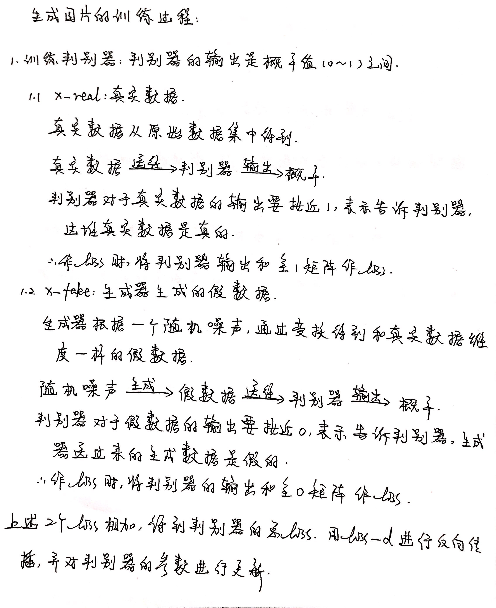
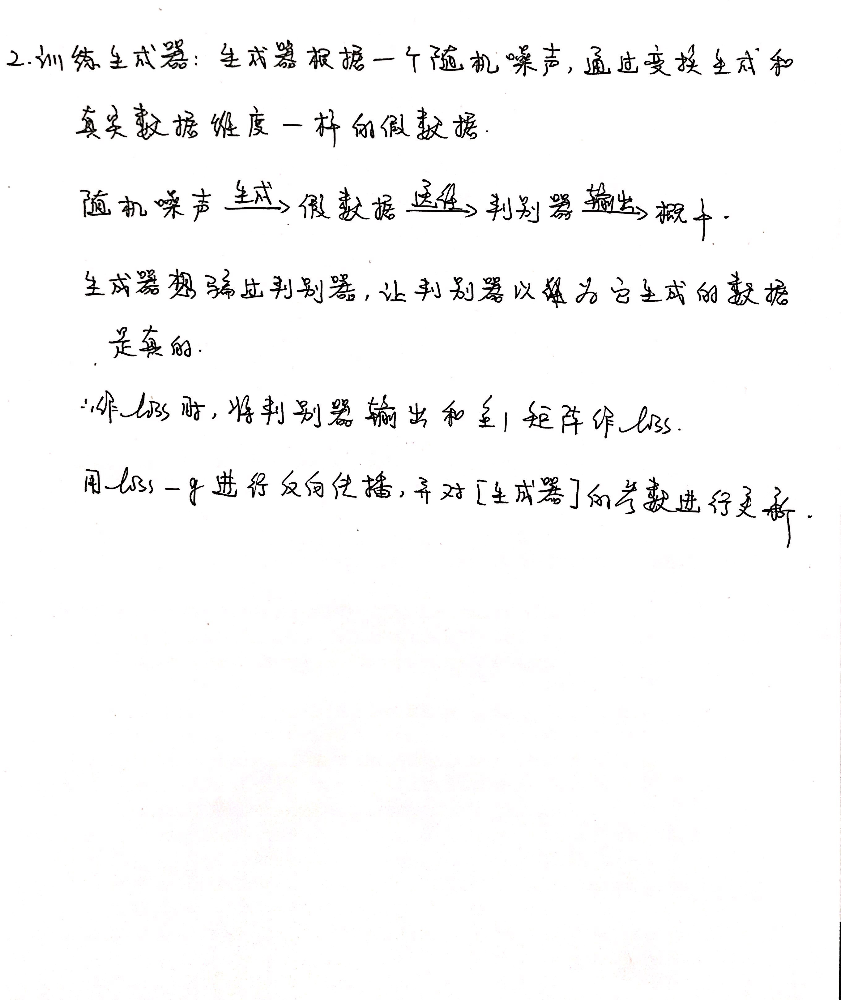

# 1. 生成图片训练过程

# 2. 训练时的生成器loss和判别器loss问题

## 2.1 现象

GAN网络在训练时，判别器的loss在不断的减小，生成器的loss在不断增加。

## 2.2 原因

判别器判别能力太强，一下子就识破送进来的是真实数据还是假数据；生成器能力太弱，无法生成质量高的数据。生成器在对抗中输给了判别器！

## 2.3 解决方法

1. 提高生成器网络生成假数据的能力；
2. 降低判别器网络鉴别真假数据的能力。

参考链接：

1. [Pytorch - 用GAN生成MNIST图片](https://blog.csdn.net/weixin_41278720/article/details/80861284)
2. [GAN原理及公式推导](https://www.cnblogs.com/jins-note/p/10848248.html)